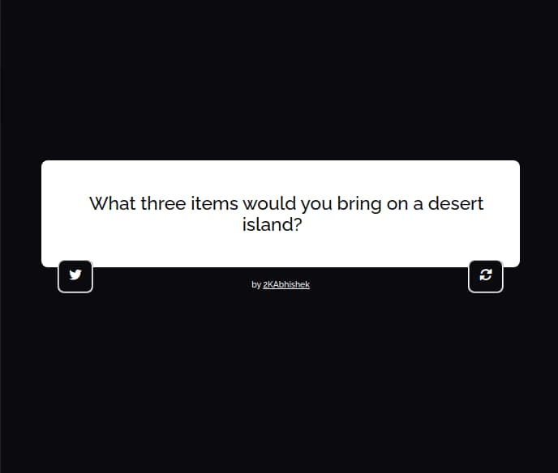

<div align = "center">

<h1><a href="https://2kabhishek.github.io/question-me">question-me</a></h1>

<a href="https://github.com/2KAbhishek/question-me/blob/main/LICENSE">
 </a>

<a href="https://github.com/2KAbhishek/question-me/pulse">
 </a>

<a href="https://github.com/2KAbhishek/question-me/stargazers">
</a>

<a href="https://github.com/2KAbhishek/question-me/network/members">
 </a>

<a href="https://github.com/2KAbhishek/question-me/watchers">
 </a>

<a href="https://github.com/2KAbhishek/question-me/graphs/contributors">
 </a>

<a href="https://github.com/2KAbhishek?tab=followers">
 </a>

<h3>Breaks ice with random questions 🧊❓</h3>

<figure>
  
  <br/>
  <figcaption>question-me screenshot</figcaption>
</figure>

</div>

## What is this

question-me is a minimalistic random question machine, that hits you with ice breaking questions.

## Inspiration

Needed a tool to throw random ice breakers during team meetings.

(P.S: This is actually a search and replace solution on another one of my repos [quote-me](https://github.com/2kabhishek/quote-me).)

## Prerequisites

Before you begin, ensure you have met the following requirements:

- You have installed the latest version of any web browser.

## Getting question-me

To get question-me, follow these steps:

```bash
git clone https://github.com/2kabhishek/question-me
cd question-me
# Open index.html in your browser
$EDITOR . # Take a look at the source code
```

## Using question-me

Click on the reload button to get a new question.

Click on the tweet button to tweet the question.

## How it was built

question-me was built using `HTML, CSS, jQuery` (ahh the good old days).

## What I learned

- Re visited jQuery.
- Some css fun.

Hit the ⭐ button if you found this useful.

## More Info

<div align="center">

<a href="https://github.com/2KAbhishek/question-me">Source</a> |
<a href="https://2kabhishek.github.io/question-me">Website</a>

</div>
